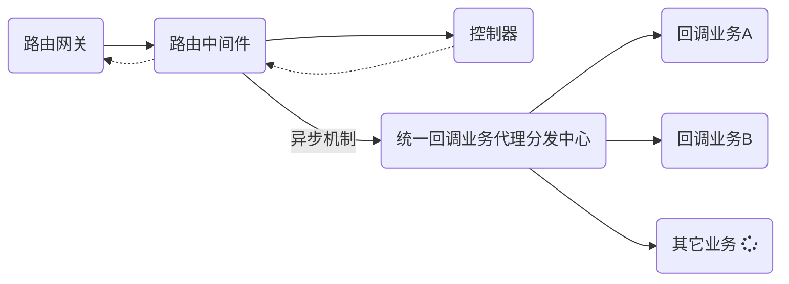

# 平台回调机制设计方案

## 概览说明

为了更好地理解、构建以及平台运行异步回调模块，我们采取设计模式的方式进行设计回调机制方案，涉及平台所有异步回调事件，即平台的所有回调业务由回调木块统一注册、分发、处理。对于业务定义涵盖两个层面的处理，包括**业务处理** 与 **失败处理**。

针对单体应用设计，使得回调体系更加标准化、简单化。额、本质应该使用**消息队列**应付( 微服务必须使用 )


## 机制特点

- 于配置统一注册

- 业务层统一分发

- 回调异步无阻塞

- 每个回调对应验参机制

- 支持无响应延迟预处理


## 回调流程




## 编码设计

#### 定义平台回调统一路由

```ini
method=POST
type=application/json 
uri=/api/platform/callback/{type}/{id}
```


#### 约定回调报文体结构约定

```php
namespace App\Bean\Platform;

class CallbackBean {
    /**
     * @var int 业务码
     */
    public $code;


    /**
     * @var string 信息
     */
    public $message;

    /**
     * @var array 结果集
     */
    public $data;
}

```


#### 回调中间件处理无阻塞

```php
namespace App\Http\Middleware;

class Callback {
    private $_service;

    public function __construct(CallbackService $service) {
        $this->_service = $service;
    }

    /**
     * @function    handle
     * @description handle
     * @param Request $request
     * @param Closure $next
     * @return mixed
     */
    public function handle($request, Closure $next) {
        $request->request->set('ticket', Uuid::uuid());

        return $next($request);
    }

    /**
     * @function    回调响应后业务处理
     * @description 响应同时同步进行业务处理 即同步操作 防止通讯阻塞
     * @param Request  $request  request
     * @param Response $response response
     */
    public function terminate($request, $response): void {
        if ($response->isSuccessful()) {
            $this->_service->handle($request->route('type'), $request->all());

            return;
        }

        Log::error('callback error response', [$response->getStatusCode(), $response->getOriginalContent()]);
    }
}

```


#### 回调业务分发中心

```php
class CallbackService
{
    /**
     * @function    回调业务处理
     * @description 回调业务统一转发处理
     * @param int   $type    回调标识
     * @param int   $id      任务主键
     * @param array $package 原始报文
     * @author      AlicFeng
     * @datatime    20-9-3 下午2:58
     */
    public function handle(int $type, int $id, array $package): void
    {
        // 1.判断回调业务类型是否支持
        $support_type = array_keys(config('callback.services'));
        if (false === in_array($type, $support_type, true)) {
            Log::error('callback service handle failure because of not support this type', [$type, $support_type]);
        }

        // 2.参数校验.结构化
        $request        = app(CallbackRequest::class);
        $package['id']  = $id;
        $rule_validator = Validator::make($package, $request->rules());
        if ($rule_validator->fails()) {
            Log::error('callback service handle failure because of parameters are not satisfied for structure');

            return;
        }

        // 3.整理业务参数
        $bean          = new CallbackBean();
        $bean->code    = $package['code'];
        $bean->message = $package['message'];
        $bean->data    = $package['data'];

        // 4.参数校验.业务验参
        $svc_request    = CallbackHelper::getRequestEntity($type);
        $rule_validator = Validator::make($package, $svc_request->rules());
        if ($rule_validator->fails()) {
            Log::error('callback service handle failure because of parameters are not satisfied for service');

            return;
        }

        // 5.回调转发
        $svc_service = CallbackHelper::getServiceEntity($type);
        call_user_func_array([$svc_service, CallbackEnum::SIGNATURE_METHOD_HANDLE], [$id, $bean]);
    }
}
```


#### 定义回调业务接口

必须实现 `handle` 与 `failure` 接口，即正常化业务处理 以及 失败处理

```php
namespace App\Contracts\Platform;

use App\Bean\Platform\CallbackBean;

interface CallbackServiceInterface {
    /**
     * @function    handle
     * @description 回调业务处理
     * @param CallbackBean $callbackBean 回调报文实体
     */
    public function handle(CallbackBean $callbackBean): void;

    /**
     * @function    failure
     * @description 回调失败处理 目前针对没有回调的业务处理
     * @param int $id 回调标识
     */
    public function failure(int $id): void;
}
```


## 快速使用

#### 配置回调唯一枚举值

`app/Enum/Platform/CallbackEnum.php`

```php
class CallbackEnum {
    /*回调类型注册*/
    // XXX 必须以 TYPE_前缀开头 同时 定义值必须为整数[约定]
    const TYPE_XXX = 0;
}
```


#### 定义业务处理类

> 必须继承回调业务处理基类

```php
namespace App\Services\Callback;

class XxxService implements CallbackServiceInterface {
    /**
     * @function    handle
     * @description 回调业务处理
     * @param CallbackBean $callbackBean 回调报文实体
     */
    public function handle(CallbackBean $callbackBean): void {
        // todo
    }

    /**
     * @function    failure
     * @description 回调失败处理 目前针对没有回调的业务处理
     * @param int $id 回调标识
     */
    public function failure(int $id): void {
        // todo
    }
}

```


#### 定义回调请求实体

> 必选 属于强校验 规则 rule 可为空数组

```php
namespace App\Requests\Callback;

use App\Requests\Request;

class XxxCallbackRequest extends Request {
    public function rules(): array {
        return [];
    }
}

```


#### 配置中注册回调

`config/callback.php`

```php
return [
    /*回调业务模板注册*/
    'services' => [
        // XXX计算结果回调
        CallbackEnum::TYPE_XXX => [XxxService::class, XxxRequest::class]
    ],

    /*回调地址注册*/
    'address'  => [
        // 通用回调地址
        'common' => env('APP_URL') . '/api/platform/callback',
    ]
];

```


#### 约定报文结构与示例

- 响应报文

|   字段    | 必选 |   类型    |      说明      |
| :-------: | :--: | :-------: | :------------: |
|  `code`   |  是  | `integer` |  处理业务编码  |
| `message` |  是  | `string`  |  处理结果信息  |
|  `data`   |  是  | `object`  |    结果数据    |

- 示例报文

> 成功时

```json
{
  "code": 1,
  "message": "success",
  "data": {
      "id": 1,
      "score_a": 98.88,
      "score_b": 89.99
  }
}
```

> 失败时

```json
  {
        "code": -1,
        "message": "failure",
        "data": {
            "id": 1
        }
  }
```


## 回调类型码表(路由参数)

| 码值 |        说明         |
| :--: | :-----------------: |
|  0   |  `SDK` 测试训练 (默认)  |
|  1   |  成绩结果回调 |
|  2   |  测试训练 |
|  3   |  标准训练 |
|  4   |  `openvino` 训练 |


