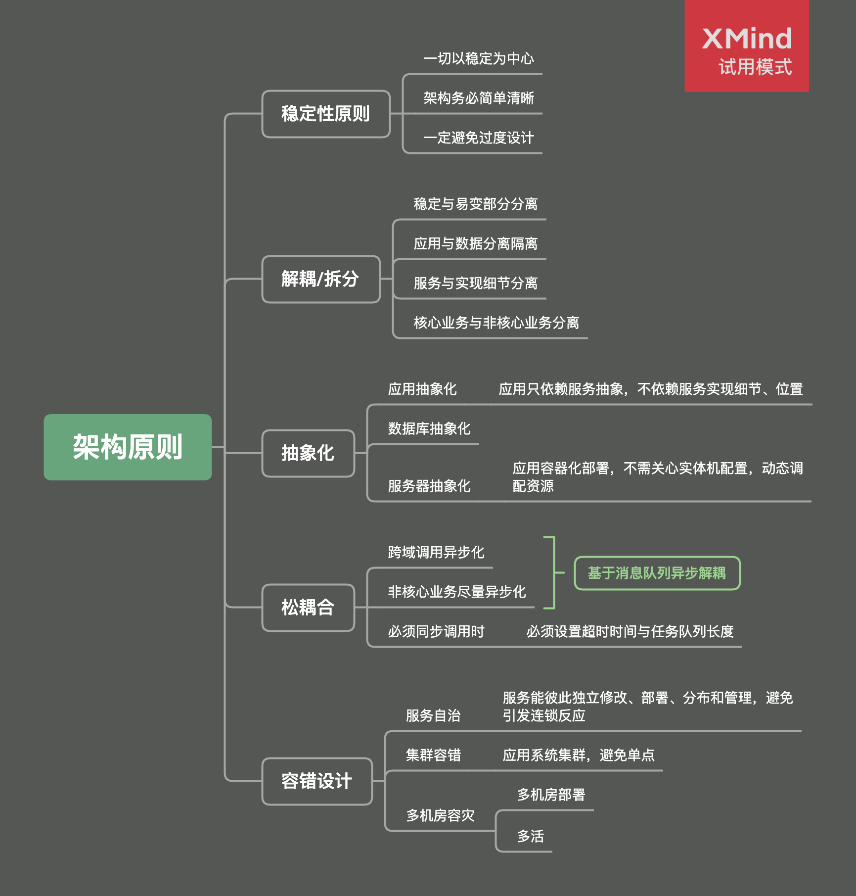
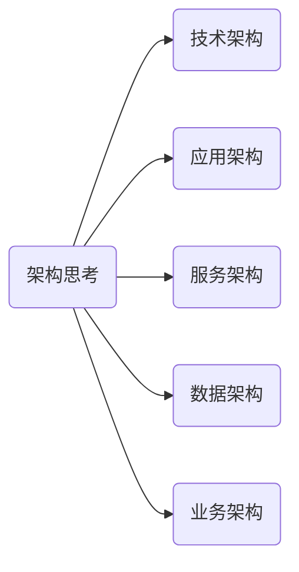

# 架构基础原则定义

## 机构原则

## 架构思考

```mermaid
graph LR

arch_thinking(架构思考)

arch_thinking_tech(技术架构)
arch_thinking_app(应用架构)
arch_thinking_svc(服务架构)
arch_thinking_data(数据架构)
arch_thinking_business(业务架构)

arch_thinking-->arch_thinking_tech
arch_thinking-->arch_thinking_app
arch_thinking-->arch_thinking_svc
arch_thinking-->arch_thinking_data
arch_thinking-->arch_thinking_business
```
