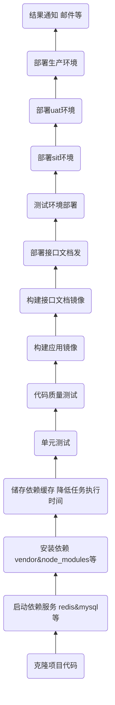

# CICD 与 DevOps

## 理解 `CICD` 与 `DevOps` 

`CICD`   

`CI` 即持续集成(`Continuous Integration`)  

`CD` 即持续部署(`Continuous Deployment`) 或 持续交付(`Continuous Delivery`)


`DevOps` 

`DevOps`(`Development` 和 `Operations` 的组合词)是一组过程、方法与系统的统称，用于促进开发、技术运营和质量保障部门之间的沟通、协作与整合。  

它是一种重视“软件开发人员(`Dev`)”和“IT运维技术人员(`Ops`)”之间沟通合作的文化、运动或惯例。透过自动化“软件交付”和“架构变更”的流程，来使得构建、测试、发布软件能够更加地快捷、频繁和可靠。  


从定义来看：其实 `devops` 就是为了让开发、运维和 `QA` 可以高效协作的流程  

而在我看来：开发即运维

## 当 `CI/CD` 遇上 `Docker`

当 `CI/CD` 遇上 `Docker` 会有什么结果呢？会更巧妙地将 `DevOps` 落地于实践~  

当践行持续集成、持续部署、持续交付，将会简化工作流程、提高工作效率、保证项目质量。


`Docker` 容器支持 `CI/CD`实现，允许开发人员通过共享映像协同构建代码，同时简化对不同基础架构的部署。使用 `Docker`，您可以构建一个 `DevOps` 实践，该实践与您选择的 `CI` 工具，任何应用程序堆栈，在 `Linux` 或 `Windows` 上运行，在任何基础架构(本地，云端或两者)上集成，常见的 `github` 搭配 `travis` 等。  


从上图可见，由研发人员作为流程的开端，同时不需要其他人员的协作参与，即可完成整一个项目迭代、交付、发版等流程，实现项目的开发到上线。  


## 流水线基本任务




## 使用 `CI/CD` 的好处

- 降低研发团队各种操作的消耗时间，提高团队的工作效率

- 提高质量，包括产品交付质量 与 仓库代码质量

- 研发流程会自动化、更加规范化

- 减少开发与运维沟通时间，降低测试成本


## 构建 `CI/CD` 环境流程

`CI/CD` 方案是 `DevOps` 中不可或缺的流程之一，工作经历当中尝试过生态上主流的解决方案，最终选择了 `Drone & Gogs` 基于 `Docker` 容器环境来构建 `CI/CD`，下文将分享如何构建此平台以及如何快速地使用到项目开发中。  


为什么我要选择 `Drone` 方案而不选择 `Jekins` 呢？简单对比一下

- `Jenkins` 是生态上比较成熟的解决方案，因为使用它是 `Java` 来编写的，项目整体比较膨大，导致它们对硬件、`CPU` 等系统资源开销比较高，同时容器化越受欢迎时，它的弊端毕露原形

- `Drone` 皆是使用 `Go` 语言来编写构建，在整体的语言性能与内存开销算是有一定的优势，同时 `Drone` 支持 `Github`、`GitLab`、`Gogs`以及 `Bitbucket`，这点很不错！更是因为它有一个良好的生态，在 `CI` 中居首位。

> `GitLab + Jenkins` 该组合还是一个不错的选择，我并没有反对，为何呢？`GitLab` 是一个非常成熟的 `git` 工具之一，同时`Jenkins` 也是非常成熟的 `CICD` 组件，功能非常强大。 但是站在生态上，我选择 `Drone` 作为 `CI` 的解决方案 。


##### 安装

还是看官网[Drone老家](https://drone.io)。为了快速了解，采取 `docker-compose` 编排 `CICD`  组件服务。  

安装非常简单，拉取 `docker-compose.yml` 编排文件，基于`Docker`环境自动构建即可~

```yaml
http://git.extremevision.com.cn/samego/gogs-drone-docker.git
cd gogs-drone-docker && docker-compose up -d
```


### 流水线

还是推荐阅览老家的文档，如下是一个简化的流水线配置文件

```yaml
kind: pipeline
name: profession-cvmart
type: docker
platform:
  os: linux
  arch: amd64

steps:
# 安装依赖
- name: install-package
  image: ccr.ccs.tencentyun.com/ev_applications/profession_cvmart:base_1.0.0
  commands:
    - COMPOSER_MEMORY_LIMIT=-1 /usr/local/bin/composer validate --no-check-all --strict
    - COMPOSER_MEMORY_LIMIT=-1 /usr/local/bin/composer install --no-dev --prefer-dist --optimize-autoloader -vvv

# 单元测试
- name: run-phpunit
  image: ccr.ccs.tencentyun.com/ev_applications/profession_cvmart:base_1.0.0
  commands:
    - ./vendor/phpunit/phpunit/phpunit
  
# 邮件通知
- name: notify-email
  image: drillster/drone-email
  settings:
    from: 18814129510@163.com
    host: smtp.163.com
    username: 18814129510@163.com
    password:
      from_secret: NOTIFY_EMAIL_PASSWORD
    port: 465
    skip_verify: true
    subject: CICD Profession Notify
    recipients:
      - a@samego.com
  when:
    status: [ failure, success ]

# 挂载声明
volumes:
  - name: cache
    host:
      path: /tmp/cache/composer
```


### 效果

如下是效果的预览图


 


