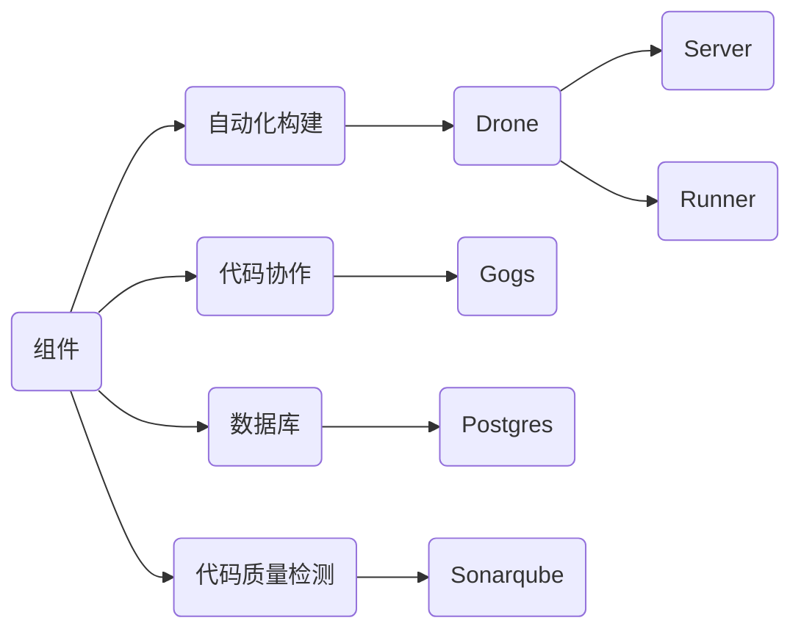

# 持续集成容器化方案

## 前言

很久之前、部署方案选择了基于 `Docker` 的容器化落地方案，极简描述与总结于 [**gogs_drone_docker**](https://github.com/alicfeng/gogs_drone_docker)。 但是随着微服务抽象定义的服务越来越多、团队规模越来越壮大时，单机部署的自动化持续部署平台在并行处理任务可能会出现大量排队、扩容机制不灵活，同时为了统一、对齐部署姿势，因此将 `Docker` 转 `Kubernetes` 。


## 目的

拥抱云原生的敏捷开发姿势，践行持续集成 / 持续部署，标准化工作流程，自动化执行流程步骤，从而提升**能效**和**质量**。


=


## 组件

此方案的组件选型并非唯一的选择，以自动化构建 `Drone` 作为基准，其它组件的选择是灵活可变的，每个组件支持丰富的选择，比如代码协作工具支持 `Gitlab`、`Gogs`等，数据库支持`SQLite`、`MySQL`、`Postgres`等

> 看不到 `mermaid` 吗？那就安装谷歌浏览器 [插件](https://chrome.google.com/webstore/detail/github-%2B-mermaid/goiiopgdnkogdbjmncgedmgpoajilohe/related)




## 部署

#### 前置说明

1. 持久化后端存储使用阿里云的 `NAS`
   
2. `VirtualService.yaml` 为阿里云网格服务的虚拟服务编排定义，根据实际情况而定，常见 `Ingress`、`Traefik` ...
   
3. 此方案上部分应用依赖 `postgres`，因便于调试采取容器化部署(生产上不推荐)
   
4. 计划后续将支持 `helm` 部署

#### 部署步骤

> ⚠️因为环境、配置、后端存储、调度策略等不一致，需要自定修改编排文件

创建命名空间

```shell
➜ kubectl create namespace devops
```

创建节点标签

```shel
➜ kubectl label nodes ${cicd_node} cicd=true
```

创建节点污点

```shell
➜ kubectl taint nodes ${cicd_node} operation=cicd:NoSchedule
```

部署组件应用

```shell
# 部署数据库依赖.postgres
kubectl apply -f postgres

# 部署代码协作工具git.gogs
kubectl apply -f gogs

# 部署自动化构建工具dorne
kubectl apply -f drone/server
kubectl apply -f drone/runner

# 部署代码质量检测工具
kubectl apply -f sonarqube
```


## 运行


## 编排

```yaml
kind: pipeline
name: Demo
type: kubernetes

clone:
  disable: true

steps:
- name: 克隆源码
  image: drone/git

- name: 加载缓存
  image: drillster/drone-volume-cache
  volumes:
  - name: cache
    path: /cache
  settings:
    restore: true
    mount:
    - ./vendor

- name: 安装依赖
  image: registry.cn-shenzhen.aliyuncs.com/tq_library/php8.0_runtime:develop
  commands:
  - composer config repo.packagist composer https://mirrors.aliyun.com/composer/
  - COMPOSER_MEMORY_LIMIT=-1 /usr/local/bin/composer install --optimize-autoloader -vvv
  when:
    branch:
    - develop

- name: 单元测试
  image: registry.cn-shenzhen.aliyuncs.com/tq_library/php8.0_runtime:develop
  commands:
  - ./vendor/phpunit/phpunit/phpunit

- name: 构建镜像
  image: plugins/docker
  settings:
    username:
      from_secret: DOCKER_USERNAME
    password:
      from_secret: DOCKER_PASSWORD
    repo: registry.cn-shenzhen.aliyuncs.com/application/demo
    registry: registry-vpc.cn-shenzhen.aliyuncs.com
    insecure: true
    purge: false
    tags: ${DRONE_BUILD_NUMBER}

- name: 部署开发
  image: quay.io/honestbee/drone-kubernetes
  settings:
    kubernetes_server:
      from_secret: KUBERNETES_DEV_SERVER
    kubernetes_token:
      from_secret: KUBERNETES_DEV_TOKEN
    namespace:
      from_secret: KUBERNETES_DEV_NAMESPACE
    deployment: demo
    container: [app]
    repo: registry.cn-shenzhen.aliyuncs.com/application/demo
    tag: ${DRONE_BUILD_NUMBER}

- name: 代码分析
  image: aosapps/drone-sonar-plugin
  detach: true
  settings:
    sonar_host:
      from_secret: SONAR_HOST
    sonar_token:
      from_secret: SONAR_TOKEN
  when:
    branch:
    - develop

- name: 构建文档
  image: registry.cn-shenzhen.aliyuncs.com/tq_library/apidoc_runtime:1.0.0
  commands:
    - apidoc -c apidoc.json -i app/Http/Controllers -o document/document/demo

- name: 文档部署
  image: alicfeng/publish_aliyun_oss:1.0.1
  settings:
    access_key_id:
      from_secret: DOCUMENT_ACCESS_KEY_ID
    access_key_secret:
      from_secret: DOCUMENT_ACCESS_KEY_SECRET
    app_publish_dir:
      from_secret: DOCUMENT_APP_PUBLISH_DIR
    oss_end_point:
      from_secret: DOCUMENT_OSS_END_POINT
    oss_bucket_name:
      from_secret: DOCUMENT_OSS_BUCKET_NAME
    cdn_object_path:
      from_secret: DOCUMENT_CDN_OBJECT_PATH
    cdn_object_type:
      from_secret: DOCUMENT_OSS_OBJECT_TYPE
    cdn_region_id:
      from_secret: DOCUMENT_CDN_REGION_ID

- name: 部署测试
  image: quay.io/honestbee/drone-kubernetes
  settings:
    kubernetes_server:
      from_secret: KUBERNETES_TEST_SERVER
    kubernetes_token:
      from_secret: KUBERNETES_TEST_TOKEN
    namespace:
      from_secret: KUBERNETES_TEST_NAMESPACE
    deployment: demo
    container: [app]
    repo:  registry.cn-shenzhen.aliyuncs.com/application/demo
    tag: ${DRONE_BUILD_NUMBER}
  when:
    target:
    - test

- name: 部署生产
  image: quay.io/honestbee/drone-kubernetes
  settings:
    kubernetes_server:
      from_secret: KUBERNETES_PROD_SERVER
    kubernetes_token:
      from_secret: KUBERNETES_PROD_TOKEN
    namespace:
      from_secret: KUBERNETES_PROD_NAMESPACE
    deployment: demo
    container: [app]
    repo:  registry.cn-shenzhen.aliyuncs.com/application/demo
    tag: ${DRONE_BUILD_NUMBER=latest}
  when:
    target:
    - production

- name: 构建缓存
  image: drillster/drone-volume-cache
  volumes:
  - name: cache
    path: /cache
  settings:
    rebuild: true
    mount:
    - ./vendor

volumes:
  - name: cache
    host:
      path: /data/drone/compose

# k8s.tolerations 部署时修改了调度策略 视情况而定
tolerations:
  - key: operation
    operator: Equal
    value: cicd
    effect: NoSchedule
```

