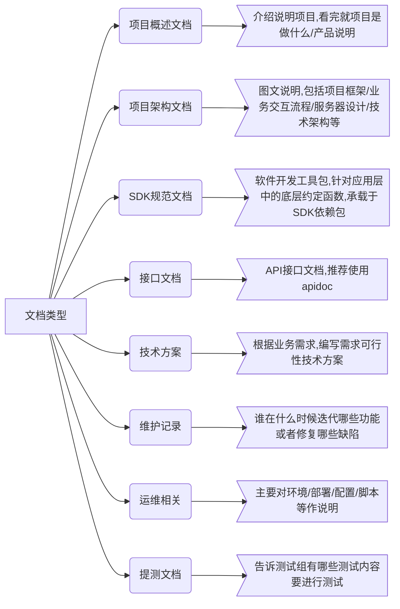

# 文档编写

## 文档编写的意义

## 文档编写的类型

> 针对开发者编写的文档类型

```mermaid
graph LR
doc_type[文档类型]

doc_type_interface(接口文档)
doc_type_interface_explain>API接口文档,推荐使用apidoc]

doc_type_plan(技术方案)
doc_type_plan_explain>根据业务需求,编写需求可行性技术方案]

doc_type_framework(项目架构文档)
doc_type_framework_explain>图文说明,包括项目框架/业务交互流程/服务器设计/技术架构等]

doc_type_maintain(维护记录)
doc_type_maintain_explain>谁在什么时候迭代哪些功能或者修复哪些缺陷]

doc_type_description(项目概述文档)
doc_type_description_explain>介绍说明项目,看完就项目是做什么/产品说明]

doc_type_sdk(SDK规范文档)
doc_type_sdk_explain>软件开发工具包,针对应用层中的底层约定函数,承载于SDK依赖包]

doc_type_operation(运维相关)
doc_type_operation_explain>主要对环境/部署/配置/脚本等作说明]

doc_type_tests(提测文档)
doc_type_tests_explain>告诉测试组有哪些测试内容要进行测试]

doc_type --> doc_type_description
doc_type_description --> doc_type_description_explain

doc_type --> doc_type_framework
doc_type_framework --> doc_type_framework_explain

doc_type --> doc_type_sdk
doc_type_sdk --> doc_type_sdk_explain

doc_type --> doc_type_interface
doc_type_interface --> doc_type_interface_explain

doc_type --> doc_type_plan
doc_type_plan --> doc_type_plan_explain

doc_type --> doc_type_maintain
doc_type_maintain --> doc_type_maintain_explain

doc_type --> doc_type_operation
doc_type_operation --> doc_type_operation_explain

doc_type --> doc_type_tests 
doc_type_tests --> doc_type_tests_explain
```

